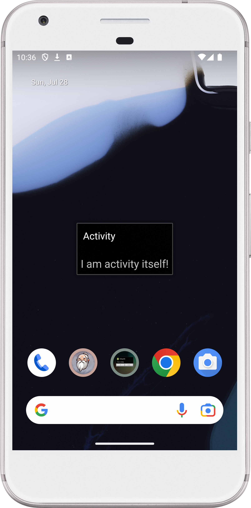

[](https://stand-with-ukraine.pp.ua)


# Tiny Activity - Android

This is a minimal Android project demonstrating that you don't necessarily
need to occupy the entire screen with your app's UI or use layout XML files.

## Concept

This project showcases an Activity that contains only a single `TextView`
created programmatically. The `TextView` displays a simple message and is
positioned with some padding.

## Code

The core of the project lies in the `MainActivity` class:

```kotlin
class MainActivity : Activity() {
    override fun onCreate(savedInstanceState: Bundle?) {
        super.onCreate(savedInstanceState)
        title = "Activity"
        val tv = TextView(this)
        tv.text = getString(R.string.activity_itself)
        tv.textSize = 20F
        tv.setPadding(20, 20, 20, 20)
        setContentView(tv)
    }
}
```

This code demonstrates:

- Creating a `TextView` instance.
- Setting the text using a string resource.- Adjusting the text size and adding
  padding.
- Setting the `TextView` as the content view of the Activity.

## Purpose

This project serves as an educational example to illustrate that Android
development offers flexibility in UI design. You can create dynamic and minimal
interfaces without relying solely on XML layouts.

**Note:** While this demonstrates the concept, building real-world apps usually
involves more complex layouts and UI elements for a better user experience.

## Screenshot:

<!--suppress CheckImageSize -->
